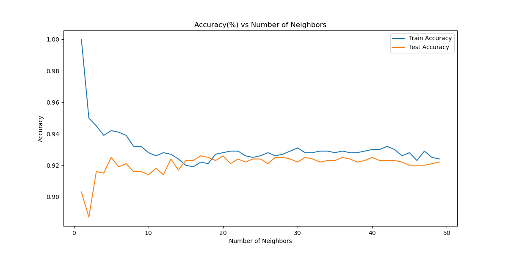
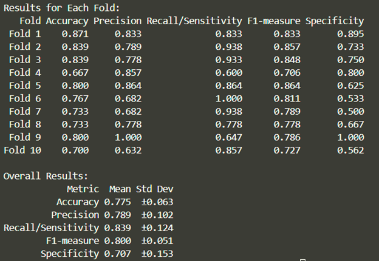
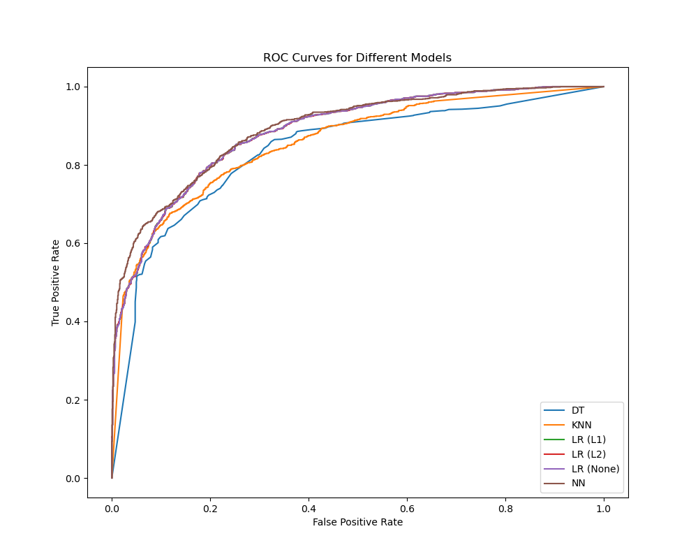

# Machine Learning Projects

This repository contains a collection of machine learning projects completed. Each branch represents a different project focusing on various machine learning concepts and implementations.

## Project Branches

1. `knn`: Implementation of K-Nearest Neighbors algorithm and performance evaluation procedures
2. `decision-tree-and-model-evaluations`: Implementation of Decision Tree algorithm and model evaluation procedures
3. `Tweets sentiment analysis`: Tweet Sentiment Analysis for Stock Market Performance Prediction
4. `Perceptron-model`: Perceptron Implementation and Model Comparison Study

## Branch Details

### K-Nearest Neighbors and Data Preprocessing
- Implementation of KNN classifier
- Data preprocessing techniques
- Model comparison with Naive Bayes
- Performance visualization and analysis

### Decision Tree and Model Evaluations
- Implementation of Decision Tree Classifier for heart disease prediction
- Evaluation using various metrics (accuracy, precision, recall, F-measure, etc.)
- Detailed performance analysis and model evaluation

### Tweets Sentiment Analysis
- Analysis of tweet impact on stock market performance
- Feature extraction from text data using TF-IDF and binary representations
- Implementation of various feature selection techniques
- Comparison of different linear regression approaches (closed-form, LASSO, SGD)
- Large-scale data processing and optimization

### Perceptron Model
- Custom implementation of Perceptron algorithm
- Comprehensive model comparison study including:
  - Logistic Regression (with different regularizations)
  - Decision Trees
  - K-Nearest Neighbors
  - Neural Networks
- Implementation of grid search and random search for hyperparameter tuning
- ROC curve analysis and performance metrics comparison

## Author

Jinghan (Summer) Sun 
jinghan.sun@emory.edu

